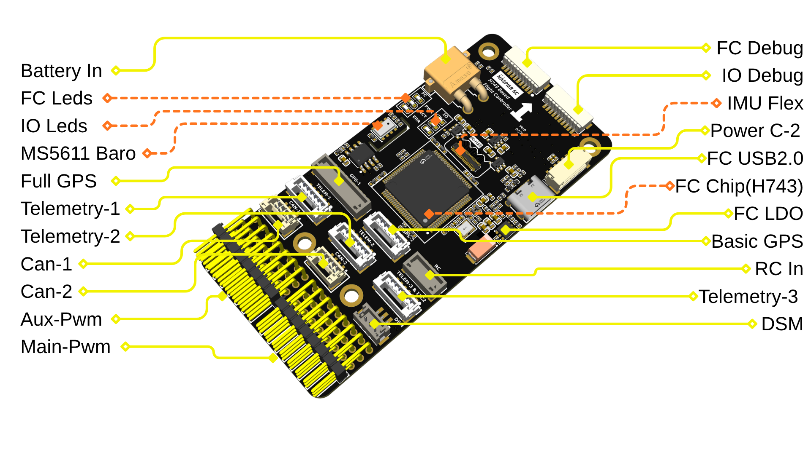
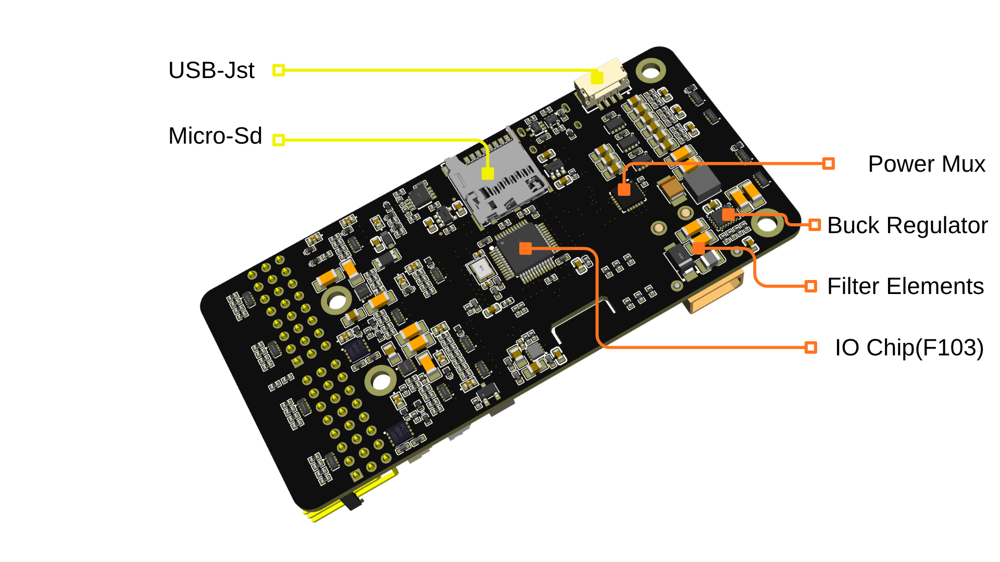
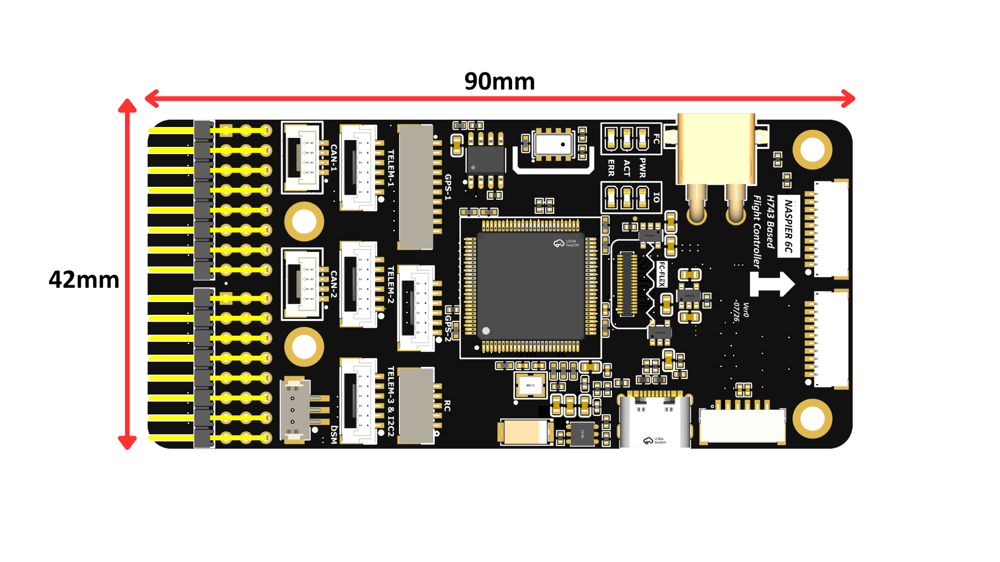

# NASPIER 6C Flight Controller

An open, **PX4/ArduPilot-class flight controller** built around an FMU + IO co-processor architecture, following the Pixhawk **FMUv6C** reference class. Designed by Naspaw.



> **Status: Initial release — documentation only.** Hardware design has not yet been produced. See [Project Status](#project-status) below.

---

## Table of Contents

- [Overview](#overview)
- [Key Features](#key-features)
- [Architecture](#architecture)
- [Power](#power)
- [Sensors](#sensors)
- [Connectors & Pinouts](#connectors--pinouts)
- [Mechanical](#mechanical)
- [Status LEDs](#status-leds)
- [Project Status](#project-status)
- [Upcoming Systems (Design Process)](#upcoming-systems-design-process)
- [Firmware Compatibility](#firmware-compatibility)
- [Repository Contents](#repository-contents)
- [License](#license)
- [Contributing](#contributing)

---

## Overview

NASPIER 6C follows the **Pixhawk reference architecture**: a dedicated **Flight Management Unit (FMU)** running the flight-critical stack, paired with a separate **I/O co-processor** that isolates RC input and PWM/servo output from the main flight computer. This is the same split used across the Pixhawk FMUv6 family, making NASPIER 6C architecturally close to other FMUv6C-class boards.

| | |
|---|---|
| **FMU MCU** | STM32H743 (Arm Cortex‑M7) |
| **IO MCU** | STM32F103 (Arm Cortex‑M3) |
| **Reference class** | Pixhawk FMUv6C‑compatible (FMU + IO split architecture) |
| **Dimensions** | 90 mm × 42 mm |
| **Power inputs** | Direct battery (XT30, 4–12S), Brick2 (Clickmate CAN-bus 5V), USB (Type‑C & JST) |
| **Buses** | 2× CAN, 3× TELEM (UART), 2× GPS ports, SBUS/PPM/DSM RC input, 16× PWM/servo outputs |
| **Storage** | microSD (logging) + onboard non-volatile parameter memory |
| **Debug** | Separate debug headers for FMU and IO MCUs |

---

## Key Features

- **Multi-source, arbitrated power input** — battery, Clickmate Brick2, and USB power are automatically arbitrated onto a single system rail, so losing one source doesn't interrupt the board.
- **Isolated per-sensor power rails** — independently switchable sensor power rails, reducing noise coupling and enabling per-sensor power cycling.
- **IMU on a separate flex daughter-board** — inertial sensors connect through a board-to-board flex connector, following standard Pixhawk practice of mechanically isolating the IMU stack from the main PCB for vibration damping.
- **Onboard barometer** for altitude sensing.
- **Non-volatile parameter storage** in addition to microSD logging.
- **Independent debug access** to both the FMU and IO microcontrollers.
- **Dual battery monitoring** — Direct Battery input and Brick2 each report status independently to the FMU (Brick2 reports voltage and current; Direct Battery input reports voltage — current sensing on this input was removed in this version).
- **Per-rail overcurrent protection** — peripheral power buses are individually current-limited and fault-monitored, so a shorted accessory doesn't brown out the whole board.

---

## Architecture

```
      Direct Battery (XT30, 4-12S)     -->  Highest priorty   --> 
      Brick2 (Clickmate, CAN-bus 5V)   -->  Secondary priorty --> LTC4417 Power Mux --> System 5V
      USB (Type-C / JST)               -->  Third priority    --> 

                                    │
                       ┌────────────┴────────────┐
                       │                          │
             ┌─────────────────────┐      ┌─────────────────────┐
             │         FMU         │      │   IO co-processor   │
             │      STM32H743      │◄────►│      STM32F103      │
             ├─────────────────────┤ UART ├─────────────────────┤
             │ IMU / sensor bus    │      │ RC input decode     │
             │ Parameter memory    │      │  (PPM/SBUS/DSM)     │
             │ I2C, UART×6, CAN×2  │      │ 8× PWM/servo (Aux)  │
             │ USB, microSD        │      │ Safety switch + LED │
             │ 8× PWM/servo (Main) │      │                     │
             │ Independent debug   │      │ Independent debug   │
             └─────────────────────┘      └─────────────────────┘
```

The FMU handles all flight-critical sensing, estimation, and control, plus telemetry, GPS, CAN, USB, and logging. The IO co-processor owns the servo rail and RC receiver decoding, so a lockup or reflash of the FMU cannot leave the vehicle without safety-switch or failsafe behavior — again mirroring standard Pixhawk practice.

---

## Power



### Power Inputs

| Input | Description |
|---|---|
| **Direct Battery Input** | XT30 connector, 4S–12S range |
| **Brick2** | Clickmate connector, CAN-bus connected, standard 5V power input (redundant power brick) |
| **Type‑C & USB JST** | USB power input, 4.7–5.2V |

### Power Domains

| Domain | Description |
|---|---|
| **System 5V Bus** | Automatically arbitrated from whichever input (Direct Battery, Brick2, or USB) is healthy; powers the whole board |
| **FMU 3.3V Rail** | Powers the flight management unit |
| **IO 3.3V Rail** | Powers the IO co-processor |
| **Sensor 3.3V Rails (isolated)** | Independently switchable rails for onboard/companion sensors |
| **High-Power Peripheral Bus (5V)** | Feeds TELEM‑1, Full GPS, and CAN‑1; current-limited with fault reporting |
| **Peripheral Bus (5V)** | Feeds TELEM‑2, TELEM‑3/GPS‑2 I2C, Basic GPS, and CAN‑2; current-limited with fault reporting |
| **Servo Rail** | Separate, board-independent supply for PWM outputs (BEC/ESC fed) |
| **DSM 3.3V Rail** | Dedicated supply for Spektrum satellite receivers |

Brick2 reports both voltage and current back to the FMU. The Direct Battery input reports voltage only — current sensing on this input was removed in this version.

---

## Sensors

| Function | Notes |
|---|---|
| Barometer (onboard) | Altitude source, on main PCB |
| IMU 1 — IIM‑42653 (accel + gyro) | On the sensor daughter-board |
| IMU 2 — BMI088 (accel + gyro) | On the sensor daughter-board |
| Magnetometer — IST8310 | On the sensor daughter-board |
| Parameter memory | Non-volatile storage for calibration/parameters, independent of the SD card |
| Logging storage | microSD, for dataflash logging |

The sensor daughter-board is mounted separately from the main PCB and connects via a board-to-board flex connector, following standard Pixhawk practice of mechanically/vibration-isolating the IMU stack.

---

## Connectors & Pinouts

All signal connectors are JST GH-style (1.25 mm pitch) unless noted. Pin 1 is marked with a square pad / dot on the silkscreen, matching the pin‑1 marker shown in each table below.

### Full GPS (GPS‑1) — JST GH, 10‑pin

Combined GPS + compass/LED + safety switch + buzzer port (primary GPS module).

| Pin | Signal |
|---|---|
| 1 | 5V |
| 2 | GPS1 UART TX |
| 3 | GPS1 UART RX |
| 4 | I2C SCL (compass / external LED) |
| 5 | I2C SDA (compass / external LED) |
| 6 | Safety switch button input |
| 7 | Safety switch LED output |
| 8 | Buzzer |
| 9 | GND |
| 10 | GND |

### Basic GPS (GPS‑2) — JST GH, 6‑pin

Secondary GPS port (UART + I2C only — no safety switch/buzzer).

| Pin | Signal |
|---|---|
| 1 | 5V |
| 2 | GPS2 UART TX |
| 3 | GPS2 UART RX |
| 4 | I2C SCL *(shared with TELEM‑3)* |
| 5 | I2C SDA *(shared with TELEM‑3)* |
| 6 | GND |

### TELEM‑1 — JST GH, 6‑pin

Full flow-control telemetry port.

| Pin | Signal |
|---|---|
| 1 | 5V |
| 2 | TX |
| 3 | RX |
| 4 | CTS |
| 5 | RTS |
| 6 | GND |

### TELEM‑2 — JST GH, 6‑pin

Full flow-control telemetry port.

| Pin | Signal |
|---|---|
| 1 | 5V |
| 2 | TX |
| 3 | RX |
| 4 | CTS |
| 5 | RTS |
| 6 | GND |

### TELEM‑3 & I2C2 — JST GH, 6‑pin

TELEM‑3 merged with the I2C bus onto one connector (shared with the Basic GPS port).

| Pin | Signal |
|---|---|
| 1 | 5V |
| 2 | TX |
| 3 | RX |
| 4 | I2C SCL *(shared with GPS‑2)* |
| 5 | I2C SDA *(shared with GPS‑2)* |
| 6 | GND |

### CAN‑1 — JST GH, 4‑pin

| Pin | Signal |
|---|---|
| 1 | 5V |
| 2 | CAN H |
| 3 | CAN L |
| 4 | GND |

### CAN‑2 — JST GH, 4‑pin

| Pin | Signal |
|---|---|
| 1 | 5V |
| 2 | CAN H |
| 3 | CAN L |
| 4 | GND |

### RC In — JST GH, 5‑pin

PPM / SBUS receiver input.

| Pin | Signal |
|---|---|
| 1 | 5V |
| 2 | PPM / SBUS RC input |
| 3 | SBUS output (pass-through) |
| 4 | GND |
| 5 | GND |

### DSM — JST, 3‑pin

Spektrum/DSM satellite receiver input.

| Pin | Signal |
|---|---|
| 1 | 3.3V (dedicated DSM rail) |
| 2 | DSM signal |
| 3 | GND |

### Main PWM — 3×8 header (24‑pin)

FMU‑driven PWM outputs (main mixer / motor outputs). 3 rows: signal / servo power / GND.

| Row | Pins 1–8 |
|---|---|
| Signal | CH1 … CH8 |
| Power | Servo rail (common across all 8) |
| Ground | GND (common across all 8) |

### Aux PWM — 3×8 header (24‑pin)

IO‑driven auxiliary PWM outputs (same layout as Main PWM).

| Row | Pins 1–8 |
|---|---|
| Signal | CH1 … CH8 |
| Power | Servo rail (common across all 8) |
| Ground | GND (common across all 8) |

### Power inputs

| Connector | Description |
|---|---|
| Direct Battery Input | XT30, primary battery input (4–12S), voltage sensed (current sensing removed in this version) |
| Brick2 | Clickmate, CAN-bus connected secondary 5V power input, voltage/current sensed |
| Type‑C | USB power/data, 4.7–5.2V |
| USB JST | USB D+/D− breakout |

### Debug headers

| Header | Description |
|---|---|
| FC Debug | FMU debug access (SWD + debug UART) |
| IO Debug | IO co-processor debug access (SWD + SWO + debug UART) |

The two MCUs have fully independent debug access — the IO firmware can be flashed/debugged without touching the FMU and vice versa.

### Other

| Connector | Description |
|---|---|
| microSD slot | Onboard, for dataflash logging |
| FC‑FLEX | Board‑to‑board connector to the IMU sensor daughter‑board ("IMU Flex") |

---

## Mechanical



- **Board size:** 90 mm × 42 mm
- **Mounting holes:** Ø3 mm × 4
- Standard Pixhawk-style form factor — case/mounting compatibility with existing Pixhawk-family enclosures is not guaranteed and should be checked against the mechanical drawing.

---

## Status LEDs

| LED group | Location | Function |
|---|---|---|
| FC LEDs | FMU side | FMU status |
| IO LEDs | IO side | IO co-processor status |
| Safety switch LED | Full GPS port | Driven externally through the GPS/safety-switch module |

---

## Project Status

This is the **initial release** of the NASPIER 6C design.

- **PCB:** 10-layer stack-up with isolated signal / ground / power layers. Design is currently under review; production has not yet started.
- **Manufacturing target:** NEXT PCB and JLCPCB — PCB design rules are based on their capabilities.
- **IMU sensor board:** Being developed in parallel, also awaiting production.
- **Mechanical case:** Aluminum + PLA hybrid case design in process.
- **Firmware:** Not started — planned as the next step once hardware is produced and assembled.
- **Pricing:** Still being worked out. Currently only PCB production, component, and assembly costs are being calculated; no final price yet.

---

## Upcoming Systems (Design Process)

Additional boards planned as part of the same ecosystem:

| Board | Description |
|---|---|
| **Naspier 6C Mini** | Based on the Pixhawk 6C Mini form factor |
| **Naspier Single B‑ESC** | 6S, 50A, 17×40 mm, AM32-based (G071), up to DShot 1200 |
| **Naspier 4in1 ESC** | 4× 6S, 50A each, 30.5×30.5 mm mounting pattern, AM32-based (G071), up to DShot 1200 — general design in process |
| **Naspier UBEC 14S** | 4–14S input, 5.4V @ 5A single-channel BEC, UAVCAN-based current/voltage sensing |

---

## Firmware Compatibility

NASPIER 6C is **not yet an officially supported PX4 or ArduPilot target**. Firmware bring-up is planned as the next step after hardware production and assembly, for both PX4 and ArduPilot.

---

## Repository Contents

```
.
├── README.md                          # this file
├── board-top-callouts.png             # top-side connector/component map
├── board-bottom-callouts.png          # bottom-side power layout
├── board-dimensions.png               # mechanical dimensions
└── NASPIER_6C_Schematic.pdf           # full schematic
```

PCB manufacturing files (Gerbers, drill files, STEP/3D model, BOM, pick‑and‑place) are **excluded** from this repository by design.

---

## License

**CC BY‑SA 3.0** (Creative Commons Attribution‑ShareAlike 3.0) — following the license used by the upstream Pixhawk project.

This design is derived from Pixhawk reference files (including RC05, RC11, DS012, and the Pixhawk 6C design standard), which are themselves released under CC BY‑SA 3.0. Per Pixhawk's own hardware licensing terms, boards derived from Pixhawk schematic/reference files must remain open source and cannot be relicensed as proprietary — so this project follows that same license and condition:

- You may use, modify, manufacture, and sell hardware based on these files.
- You must give appropriate credit/attribution.
- Any modified version must be shared under the same CC BY‑SA 3.0 license.

Reference: [pixhawk/Hardware licensing terms](https://github.com/pixhawk/hardware).

## Contributing

This project is pre-prototype. **Feedback and questions are welcome** via Issues. Pull requests and other contributions won't be reviewed until after the first prototype has flown.
