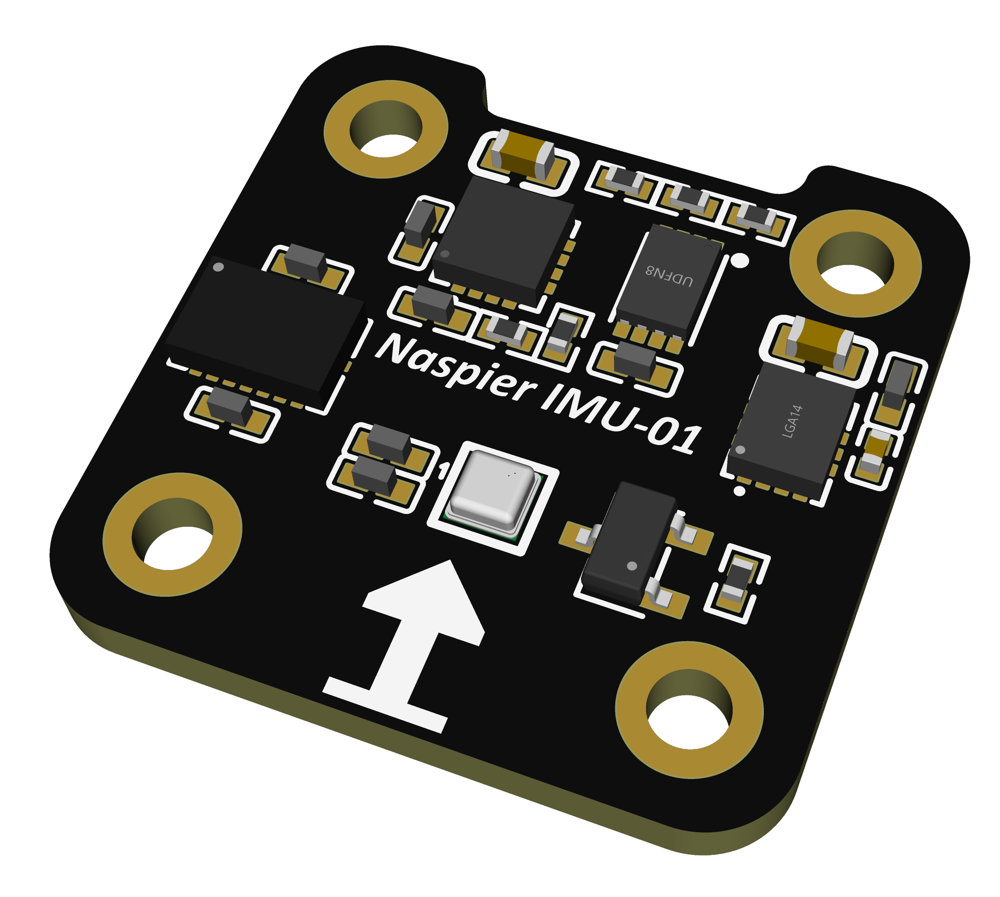
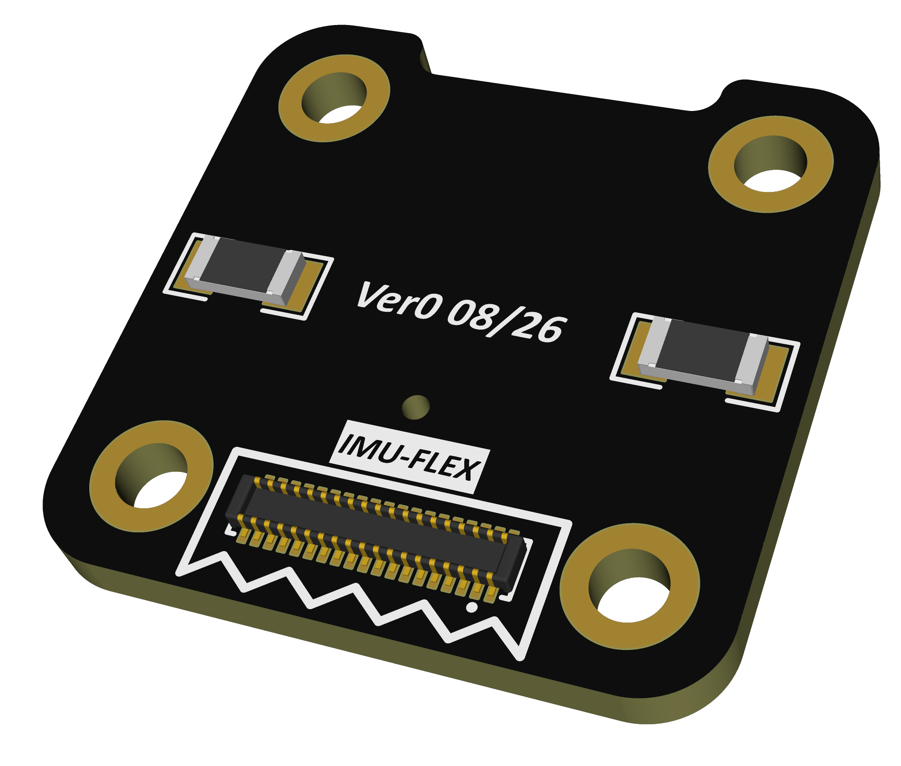
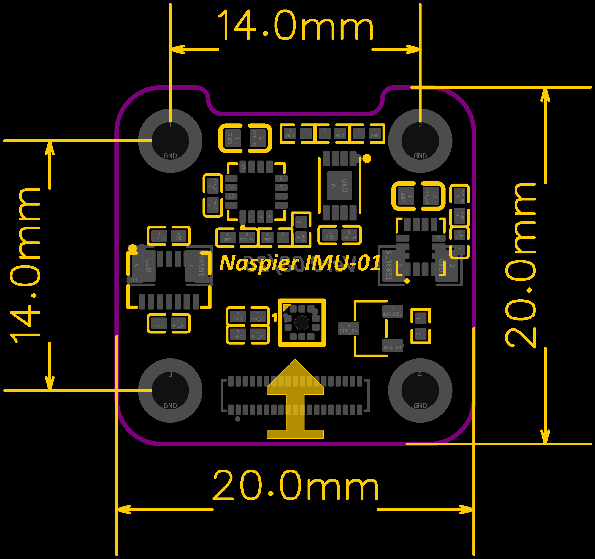
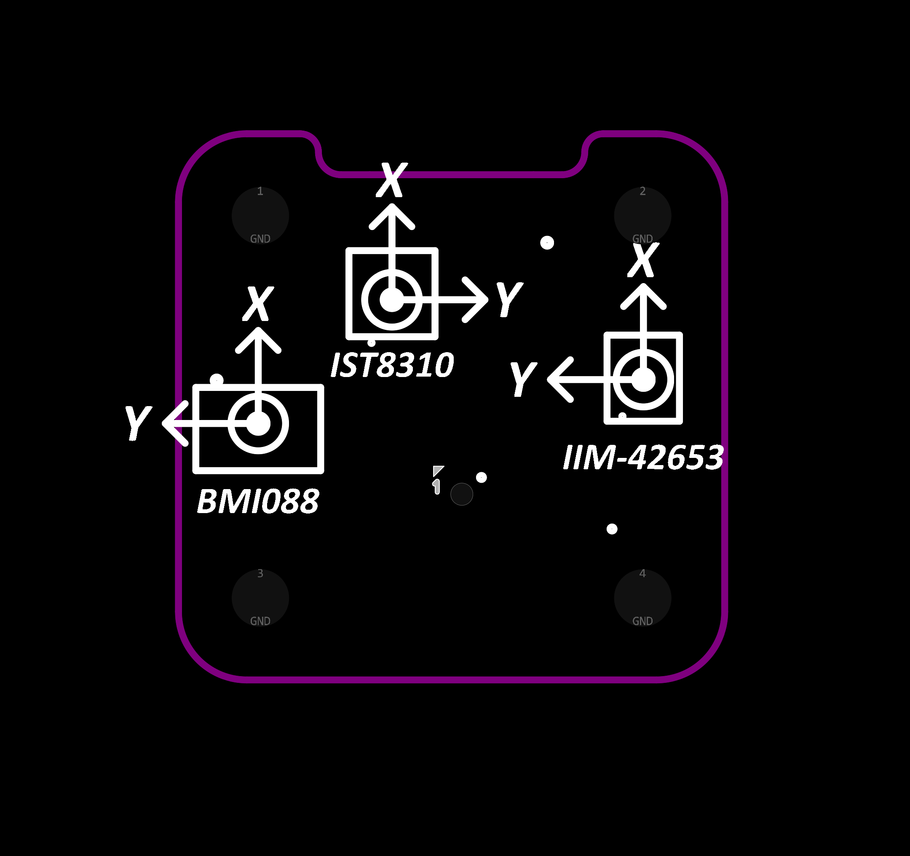
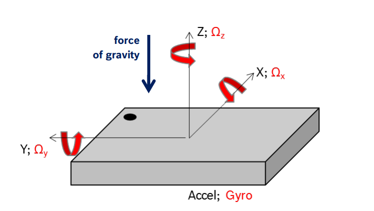
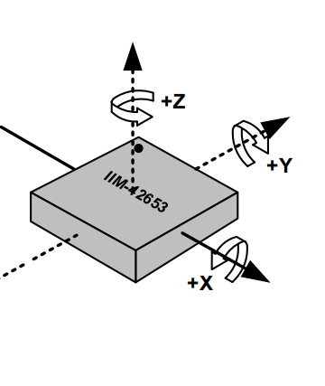
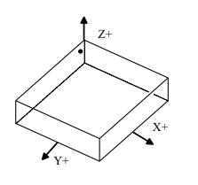

# NASPIER 6C — IMU Sensor Daughter-Board

Schematic for the IMU sensor daughter-board, mounted separately from the main PCB and connected via the FC-FLEX board-to-board connector (see main [README](../../README.md#sensors)).

**Status:** Ready for production.

**Manufacturing:** 4-layer, 1.6 mm board thickness, standard through-hole vias only (no microvias/HDI/blind-buried vias) — producible at any standard PCB fab, not limited to a specific manufacturer's advanced process.

## Board Renders

| Top | Bottom |
|---|---|
|  |  |

The 34-pin flex connector (CN1) sits on the bottom side. The arrow silkscreened on the top side marks the board's forward direction, matching the axis references below. The two notches on the upper edge (between the top mounting holes) are mechanical alignment slots, used to guide the board into the correct orientation/position during assembly. Heater resistors are placed on the bottom side to avoid causing EMI on the magnetometer.

## Mechanical



- **Board size:** 20 mm × 20 mm
- **Mounting holes:** 4x Ø2mm, on a 14 mm × 14 mm grid
- **Alignment slots:** mechanical slots on the upper edge for assembly alignment

## Components

| Function | Part | Bus | Rail |
|---|---|---|---|
| IMU-1 (accel + gyro) | BMI088 | SPI | 3V3_Bus_3 |
| IMU-2 (accel + gyro) | IIM-42653 | SPI | 3V3_Bus_2 |
| Magnetometer | IST8310 | I2C  | 3V3_Bus_4 |
| Barometer | BMP581 — **DNP for 6C** | I2C  | 3V3_Bus_4 |
| Sensor calibration EEPROM | 24C02 | I2C  | 3V3_Bus_4 |
| Heater | MOSFET-driven resistive heater (2× 51Ω) | — | VDD_5V |

Each IMU sits on its own isolated 3.3V rail, separate from the shared mag/baro/EEPROM rail, matching the main board's per-sensor power isolation.

## Sensor Orientation



All three sensors are mounted with **X pointing toward the board's forward arrow**. BMI088 and IIM-42653 also share the same Y axis (pointing left of forward); **IST8310's Y axis is mirrored** (pointing right of forward) relative to the two IMUs — account for this when setting mag rotation/calibration in firmware.

Per-part datasheet axis references, used to derive the orientation above:

| BMI088 | IIM-42653 | IST8310 |
|---|---|---|
|  |  |  |

## Notes

- **BMP581 is DNP (not populated) on the 6C build.** The pad is placed so the same sensor board design can serve both the 6C standard (which uses the onboard barometer on the main PCB) and a future 6X-class design (no onboard baro), by populating BMP581 there instead.
- **Onboard heater** drives two 51Ω/660mW resistors via an AO3400 MOSFET, gated by a HEATER control line from the FMU — for IMU thermal stabilization.
- **Sensor EEPROM** (24C02) stores per-unit sensor calibration data locally on the daughter-board, independent of the FMU's own parameter storage.
- **Power Regulation** — the sensor board does not include any power regulator; regulation must be done on the baseboard side.

## Flex Connector

34-pin, 0.4 mm pitch (Hirose BM20B series). Carries 2x separated SPI buses and I2C4 (mag/baro/EEPROM), the three isolated 3.3Vdc sensor rails, 5Vdc, and the heater control signal.

The flex cable itself (length, stack-up, pinout mapping to the baseboard-side connector) is not part of this schematic and is not shared in this repository.


## Files

```
sensor-board/
├── README.md
├── NASPIER_IMU-01_Schematic.pdf   # schematic
└── pngs/
    ├── board-top.png                   # board render, top
    ├── board-bottom.png                # board render, bottom
    ├── board-dimensions.png            # dimensioned mechanical drawing
    ├── sensor-orientation.png          # on-board sensor axis orientation
    ├── bmi088-axis-reference.png       # BMI088 datasheet axis reference
    ├── iim-42653-axis-reference.png    # IIM-42653 datasheet axis reference
    └── ist8310-axis-reference.png      # IST8310 datasheet axis reference
```
